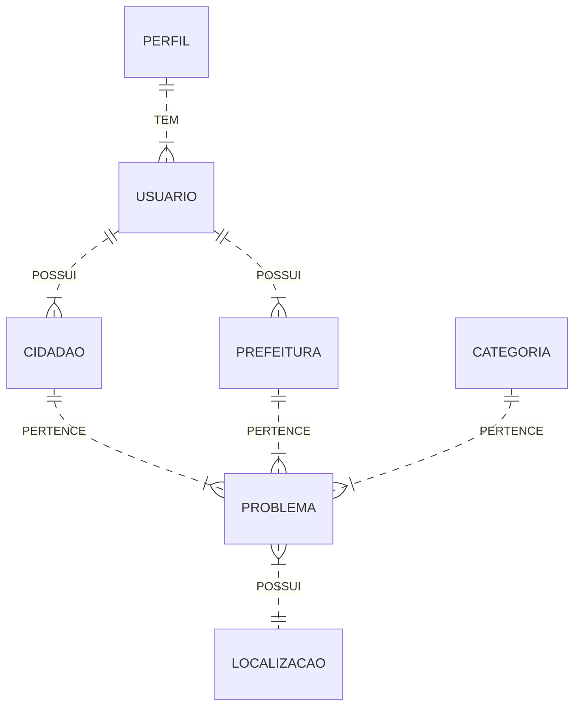

# api_soscidade

O SOSCidade surge como uma proposta de sistema que visa solucionar os problemas de infraestrutura urbana, que se referem às estruturas e serviços necessários para o funcionamento de uma cidade, considerando aspectos ambientais, sociais e econômicos.

<br/>

> ### 🙍‍♂️ Atores do sistema

| Entidades             | Descrição                                                                |
| ----------------- | ------------------------------------------------------------------ |
| Cidadão |  O cidadão será a entidade principal desta aplicação, podendo realizar denúncias, acompanhar as denúncias em seus **dashboard**, alterar ou excluir os dados da denúncia, além da possibilidade de alterar seus dados na aba **perfil**. |
| Prefeitura |  A prefeitura poderá criar uma conta de acesso parar ir acompanhando as denúncias feitas pelos cidadãos da cidade ao qual pertence, para cada denúncia resolvida, será alterado o status para solucinado no **dashboard** do cidadão. |
| Administrador |  O Administrador terá acesso total a aplicação, podendo visualizar todos os usuários existentes e suas denúncias com objetivo de manter o controle da aplicação. O Administrador também terá ter poder de excluir aqueles usuários que não esitverem em conformidade com os termos de responsabilidade. |

<br/>

> ### 🛠 Funcionalidades

| Funcionalidade             | Descrição                                                                |
| ----------------- | ------------------------------------------------------------------ |
| RF01 |  Acessar rotas públicas no sistema |
| RF02 |  Criar usuários (cidadão, prefeitura) |
| RF03 |  Realizar denúncias logado no sistema |
| RF04 |  Visualizar, editar e/ou excluir denúncias |
| RF05 |  Alterar as denúncias pendentes para finalizadas |
| RF06 |  Moderador com acesso admin ao sistema  |

<br/>

> ### 🖥 Telas identificadas no sistema

- Tela inícial
- Tela de Login
- Tela de cadastro de usuário
- Tela de denúncia
- Tela dashboard
- Tela de editar
- Tela de perfil
- Tela de Not Page

<br/>

> ### 🖇 Diagrama ERP



<br/>

> ### 🗂 Arquitetura das pastas (front-end)


<br/>

> ### ⚙ Dependências

 - [http-status-codes](https://www.npmjs.com/package/http-status-codes)
 - [jsonwebtoken](https://jwt.io/)
 - [sequelize](https://sequelize.org/)
 - [bcrypt](https://www.npmjs.com/package/bcrypt)
 - [express](https://expressjs.com/pt-br/)
 - [multer](https://www.npmjs.com/package/multer)
 - [pg](https://www.npmjs.com/package/pg)

<br/>

> ### ⚙ Dependências de desenvolvimento
 - [eslint-config-prettie](https://github.com/prettier/eslint-config-prettier)
 - [nodemon](https://nodemon.io/)
 - [prettier](https://prettier.io/)
 - [sucrese](https://sucrase.io/)
 - [yup](https://www.npmjs.com/package/yup)

<br/>

> ### 🚩 Endpoints/rotas

```http
  BaseURL (http://localhost:8080)
```
```http
  Token (Chave de autorização e autenticação)
```

#### Rotas de usuário

| Requisição | Rota     | Descrição                |
| :-------- | :------- | :------------------------- |
| `GET` | `/usuarios` | Buscar todos os usuários |
| `GET` | `/usuario` | Verificar se usuário existe através do **token** |
| `GET` | `/usuario/:id` | Buscar usuário pelo seu ID |

#### Rotas de cidadão

| Requisição | Rota     | Descrição                |
| :-------- | :------- | :------------------------- |
| `GET` | `/cidadaos` | Buscar todos os cidadaos |
| `GET` | `/cidadao/:id` | Verificar se cidadão existe pelo ID |
| `POST` | `/cidadaos/cadastrar` | Criar novo registro |
| `PUT` | `/editar/:id` | Editar cidadão pelo ID |
| `DELETE` | `/excluir/:id` | Excluir cidadão pelo ID |

#### Rotas de prefeitura

| Requisição | Rota     | Descrição                |
| :-------- | :------- | :------------------------- |
| `GET` | `/prefeituras` | Buscar todas as prefeituras |
| `GET` | `/prefeitura/:id` | Verificar se prefeitura existe pelo ID |
| `POST` | `/prefeitura/cadastrar` | Criar novo registro |
| `PUT` | `/prefeitura/editar/:id` | Editar prefeitura pelo ID |
| `DELETE` | `/prefeitura/excluir/:id` | Excluir prefeitura pelo ID |

#### Rotas de problema

| Requisição | Rota     | Descrição                |
| :-------- | :------- | :------------------------- |
| `GET` | `/problemas` | Buscar todos os problemas |
| `GET` | `/problema/:id` | Buscar problema pelo ID |
| `GET` | `/problemas/usuario/:id` | Buscar problemas pelo **token** do usuario |
| `GET` | `/problemas/pendentes` | Buscar problemas pendentes |
| `GET` | `/problemas/finalizados` |Buscar problemas finalizados |
| `POST` | `/problemas/cadastrar/:tipo` | Registrar novo problema |
| `PUT` | `/problemas/editar/:id` | Editar problema pelo ID |
| `DELETE` | `/problemas/excluir/:id` | Excluir problema pelo ID |

#### Outras rotas

| Requisição | Rota     | Descrição                |
| :-------- | :------- | :-------------------------------- |
| `GET`      | `baseURL/` | Página inicial da aplicação |
| `POST`      | `baseURL/login` | Rota de login de usuário |
| `GET`      | `baseURL/imagem/:imagemName` | Busca imagem pelo nome |

<br/>

> ### 💾 Configuração e instalação

Clonar o repositório

```bash
git clone https://github.com/RubensLFerreira/soscidade.git
```
Clonar a API api_soscidade

```bash
git clone https://github.com/RubensLFerreira/api_soscidade.git
```

Instalar todas as depedências necessarias de ambos diretórios
```bash
npm install
```

Inicia primeiro API e depois a aplicação soscidade com o mesmo comandos abaixo
```bash
npm run dev
```

Acessar o endereço
```bash
http://localhost:5173/
```

Observação: 

- Baixar as extensões recomendadas na pasta `.vscode`.
- É necessário atualizar a conexão com banco de dados com suas credências no arquivo `.venv` com base no exemplo `.venv.exemple`.
- Passar um valor aleatório para a chave SECRET no arquivo `.venv.exemple`.
- A API deve rodar na porta 8080

<br/> 

> ### 🏆 Equipe

- [RubensLFerreira](https://github.com/RubensLFerreira)
- [devrodrigocsoares](https://github.com/devrodrigocsoares)
- [Guilgb](https://github.com/Guilgb)

<table align="center">
  <tr align="center">
    <td>
      <a href="https://github.com/RubensLFerreira">
        
        <p>Rubens <br/>Lima</p>
      </a>
    </td>
    <td>
      <a href="https://github.com/RubensLFerreira">
        
        <p>Rubens <br/>Lima</p>
      </a>
    </td>
    <td>
      <a href="https://github.com/RubensLFerreira">
        
        <p>Rubens <br/>Lima</p>
      </a>
    </td>
  </tr>
</table>
